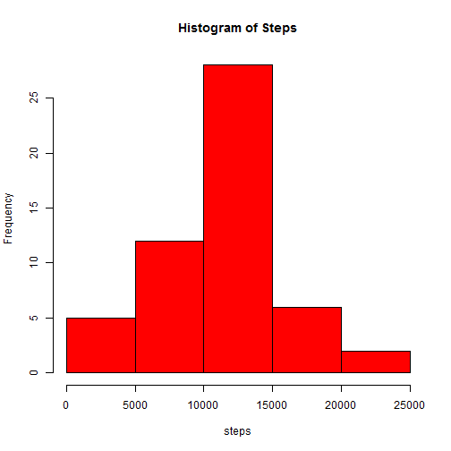
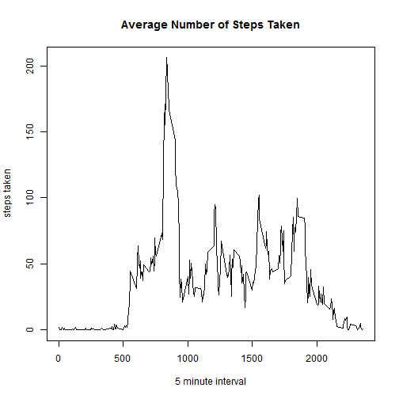
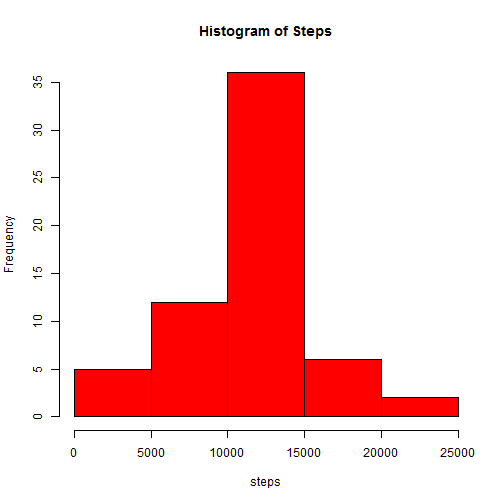
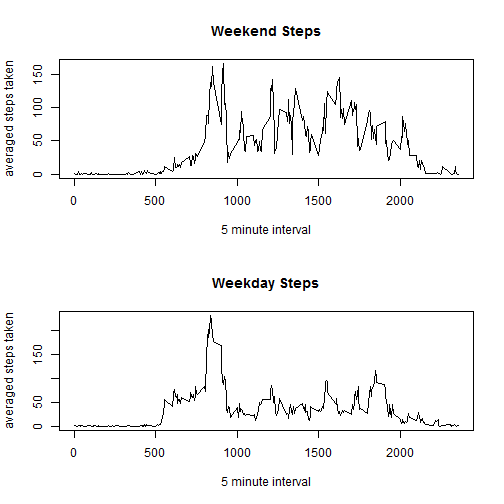

```r
data = read.csv("activity.csv")
```

A histogram of the total number of steps taken per day:

```r
data_summary = data %>% group_by(date) %>% summarise_each(funs(sum), steps)
hist(data_summary$steps,xlab="steps",col='red',main="Histogram of Steps")
```

 


The mean of the number of steps taken:

```r
mean(data_summary$steps,na.rm=TRUE)
```

```
## [1] 10766.19
```
The median of the number of steps taken:

```r
median(data_summary$steps,na.rm=TRUE)
```

```
## [1] 10765
```

A time series plot of the 5 minute interval (x-axis) and the average number of steps taken, averaged across all the days (y-axis):


```r
data_summary2 = data %>% group_by(interval) %>% summarise_each(funs(mean(.,na.rm=TRUE)), steps)
plot(data_summary2$interval,data_summary2$steps,type='l', xlab="5 minute interval",ylab="steps taken",main="Average Number of Steps Taken")
```

 

The maximum number of steps of the five minute interval on average across all days is:

```r
data_summary2[which.max(data_summary2$steps),]
```

```
## Source: local data frame [1 x 2]
## 
##   interval    steps
## 1      835 206.1698
```

The total number of missing values in the data set is :

```r
sum(is.na(data$steps))
```

```
## [1] 2304
```

A new data set is created by filling in for each missing value with the mean for that 5 minute interval:

```r
for(i in 1:length(data$steps)){
  if (is.na(data$steps[i])){
    data$steps[i] = data_summary2$steps[
      which(data_summary2$interval == 
              data$interval[i])]
  }
}
```


```r
data_summary3 = data %>% group_by(date) %>% summarise_each(funs(sum), steps)
```

A histogram of the total number of steps taken each day:

```r
hist(data_summary3$steps,xlab="steps",col='red',main="Histogram of Steps")
```

 

The mean of the total number of steps taken is:

```r
mean(data_summary3$steps)
```

```
## [1] 10766.19
```
and the median is:
'''{r}
median(data_summary3$steps)
```

A new factor variable with two levels-- "weekday" and "weekend":

```r
for(i in 1:length(data$steps)){ 
  if(weekdays(as.Date(data$date[i]))==
     "Saturday" || weekdays(as.Date(
       data$date[i]))=="Sunday"){
    data$day[i] = "weekend"} else{
      data$day[i]="weekday"} }


data_summary4 = data %>% group_by(day,interval)%>%
  summarise_each(funs(mean(.,na.rm=TRUE)), 
                 steps)

data_weekday = subset(data_summary4,day==
                        "weekday",select = 
                        interval:steps)

data_weekend = subset(data_summary4,day==
                        "weekend",select =
                        interval:steps)
```

A panel plot of the weekday and weekend steps:

```r
par(mfrow=c(2,1))

plot(data_weekend$interval,data_weekend$steps, type = 'l', xlab="5 minute interval", ylab="averaged steps taken",main="Weekend Steps")

plot(data_weekday$interval,data_weekday$steps, type = 'l', xlab = "5 minute interval", ylab = "averaged steps taken",main="Weekday Steps")
```

 


